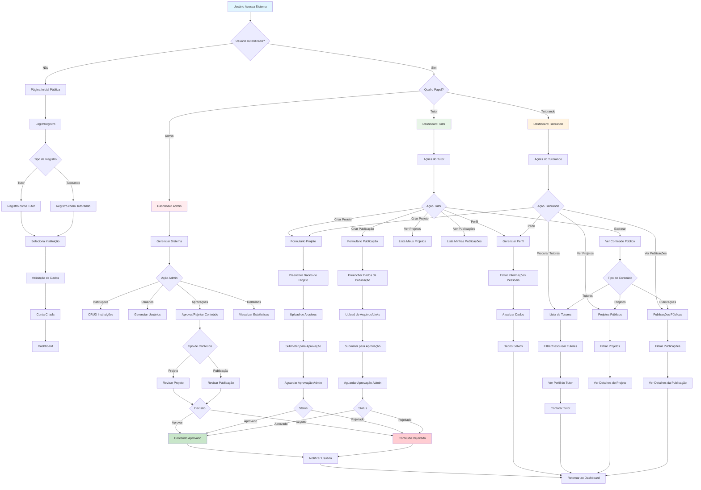
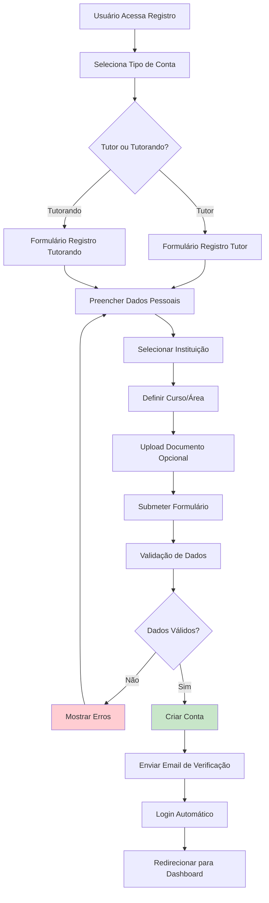
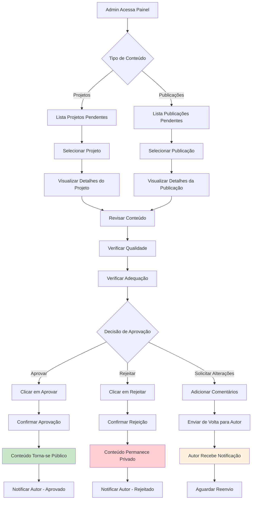
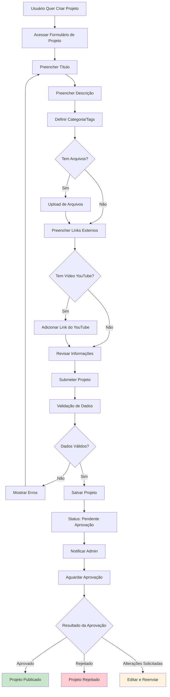
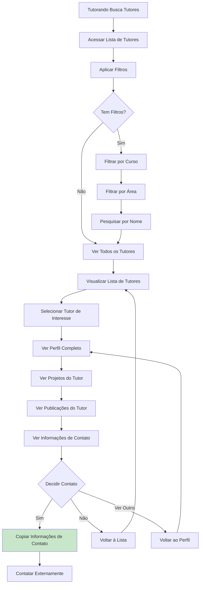
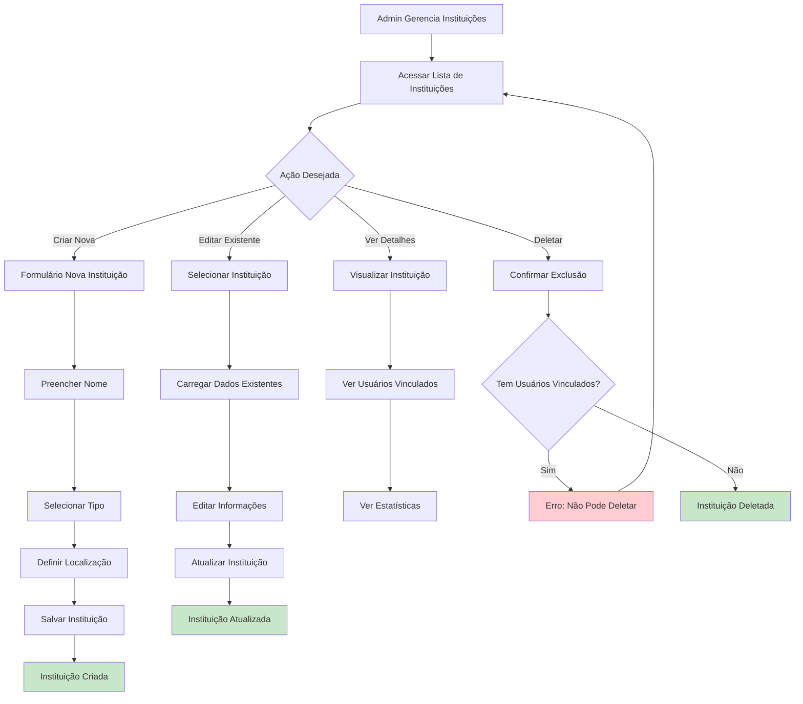
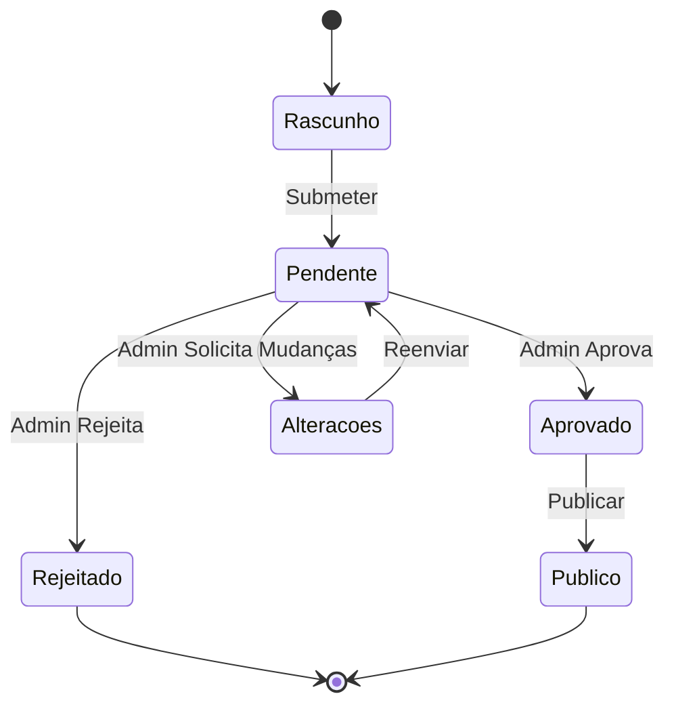
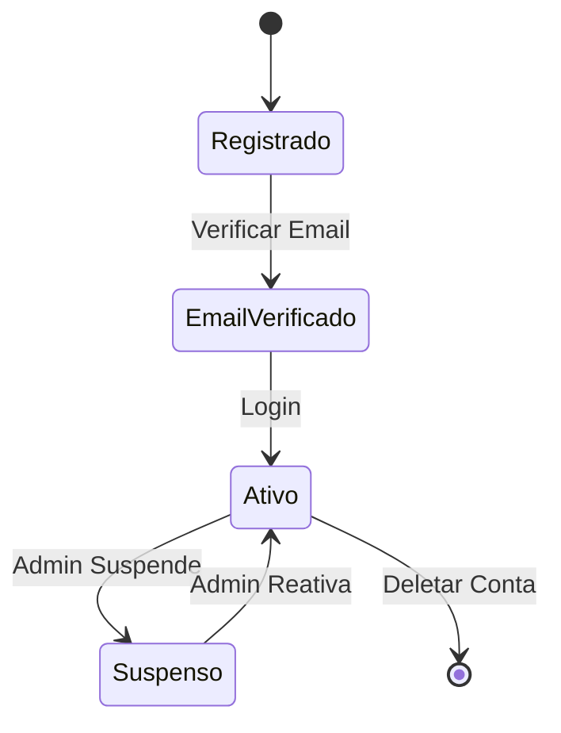

# Diagrama de Atividade - Sistema Tutorando

## Visão Geral do Sistema

O sistema Tutorando é uma plataforma de interação entre tutores e tutorandos com três tipos principais de usuários:
- **Admin**: Administra instituições, aprova conteúdo, gerencia usuários
- **Tutor**: Cria projetos e publicações, visualiza conteúdo, gerencia perfil
- **Tutorando**: Cria projetos, visualiza tutores e conteúdo, gerencia perfil

## Diagrama de Atividade Principal

## Diagramas de Atividade Específicos

### 1. Processo de Registro de Usuário

### 2. Processo de Aprovação de Conteúdo (Admin)

### 3. Criação de Projeto (Tutor/Tutorando)

### 4. Busca e Contato com Tutores

### 5. Gestão de Instituições (Admin)

## Fluxos de Estados dos Objetos

### Estado do Projeto/Publicação

### Estado do Usuário

## Resumo dos Principais Fluxos

1. **Autenticação e Registro**: Usuários se registram como tutor ou tutorando, vinculam-se a uma instituição
2. **Criação de Conteúdo**: Tutores e tutorandos criam projetos; apenas tutores criam publicações
3. **Aprovação de Conteúdo**: Administradores revisam e aprovam/rejeitam projetos e publicações
4. **Descoberta de Tutores**: Tutorandos podem pesquisar e filtrar tutores por área/curso
5. **Gestão Administrativa**: Administradores gerenciam instituições, usuários e aprovações
6. **Visualização Pública**: Conteúdo aprovado fica disponível para visualização pública

## Considerações Técnicas

- **Middleware de Autenticação**: Proteção de rotas baseada em papéis (admin, tutor, tutorando)
- **Validação de Dados**: Validação no frontend e backend para todos os formulários
- **Upload de Arquivos**: Suporte para imagens, PDFs e links do YouTube
- **Notificações**: Sistema de feedback para aprovações/rejeições
- **Responsividade**: Interface adaptável para desktop e mobile
