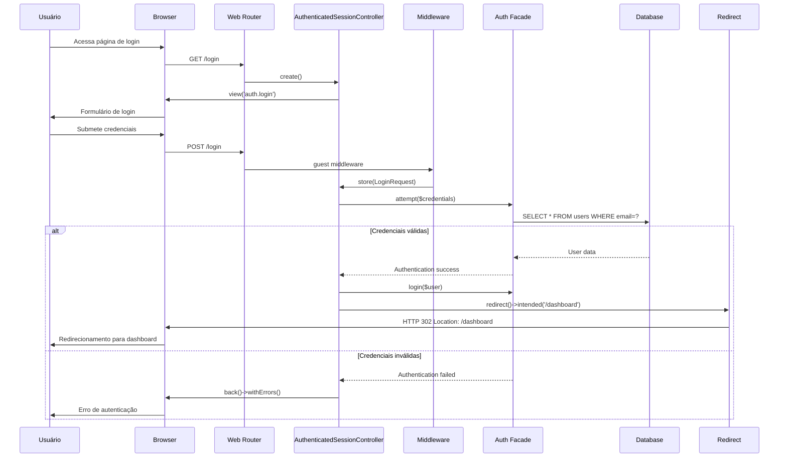
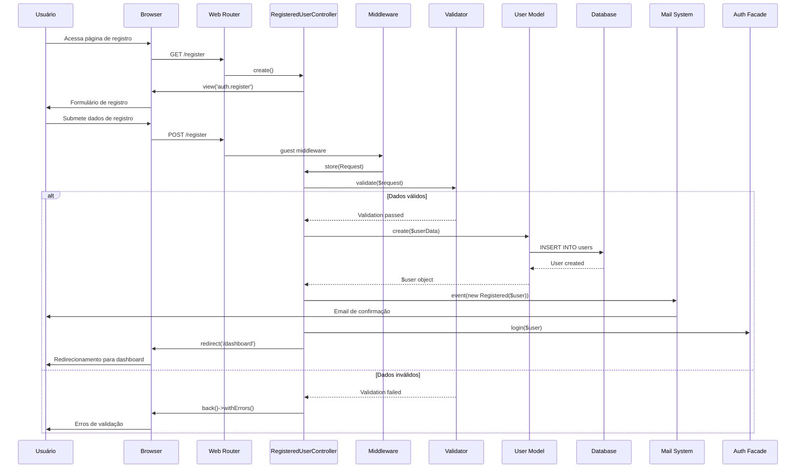
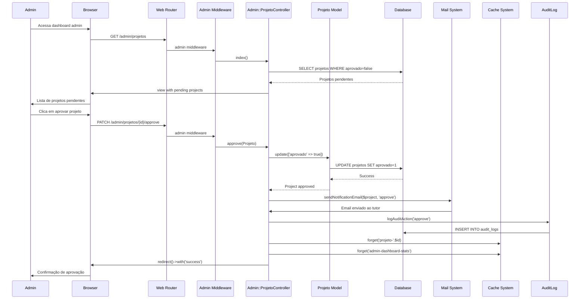
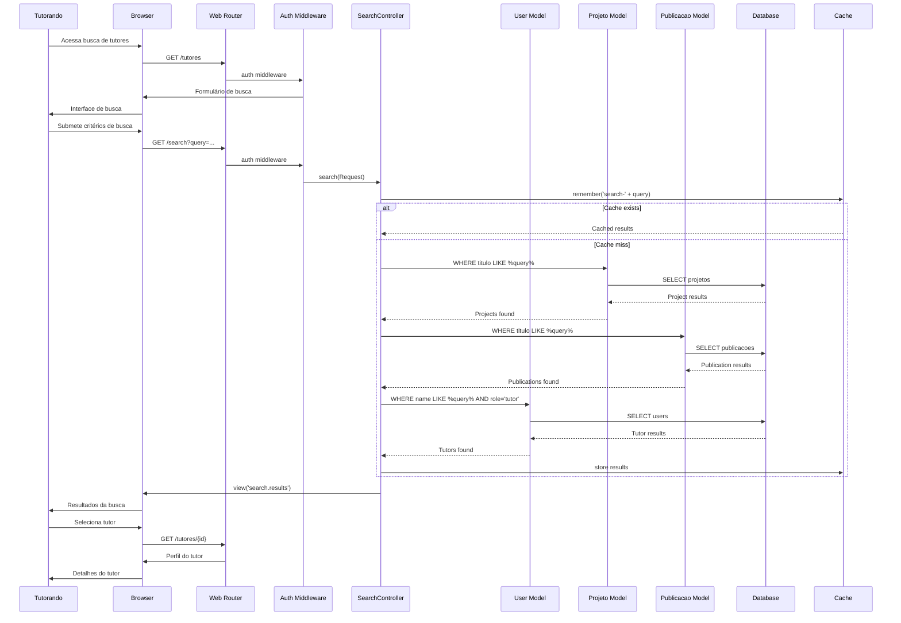
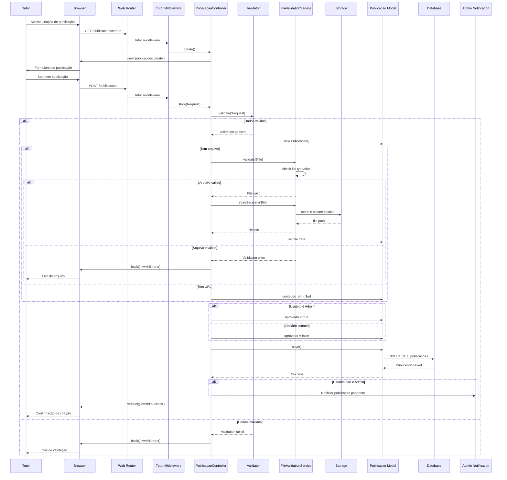
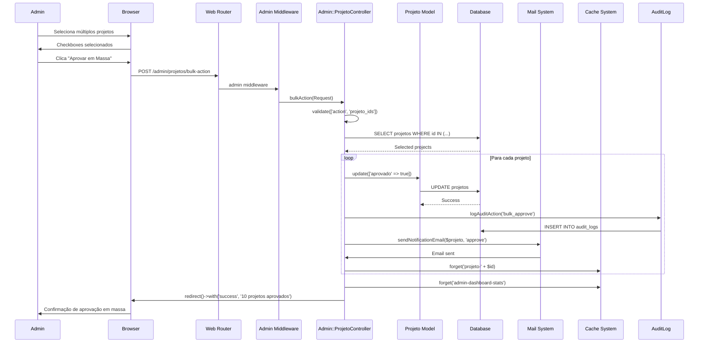
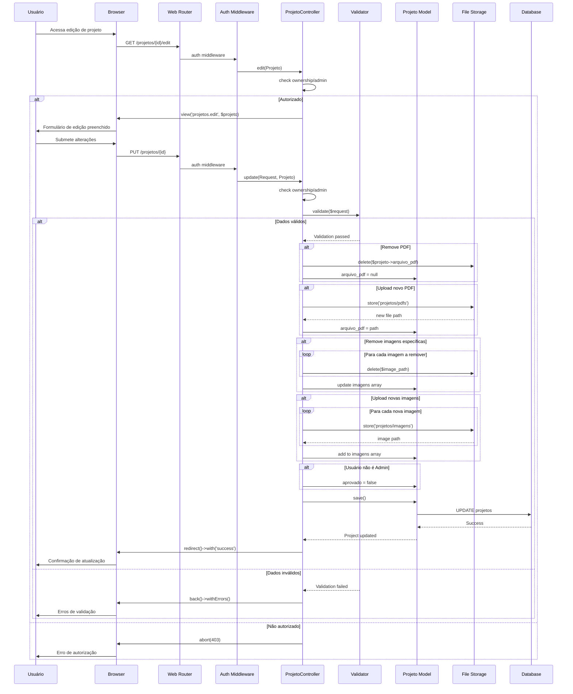
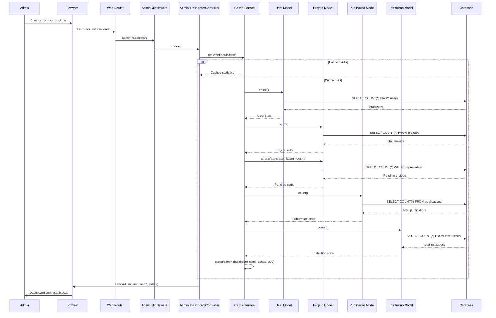
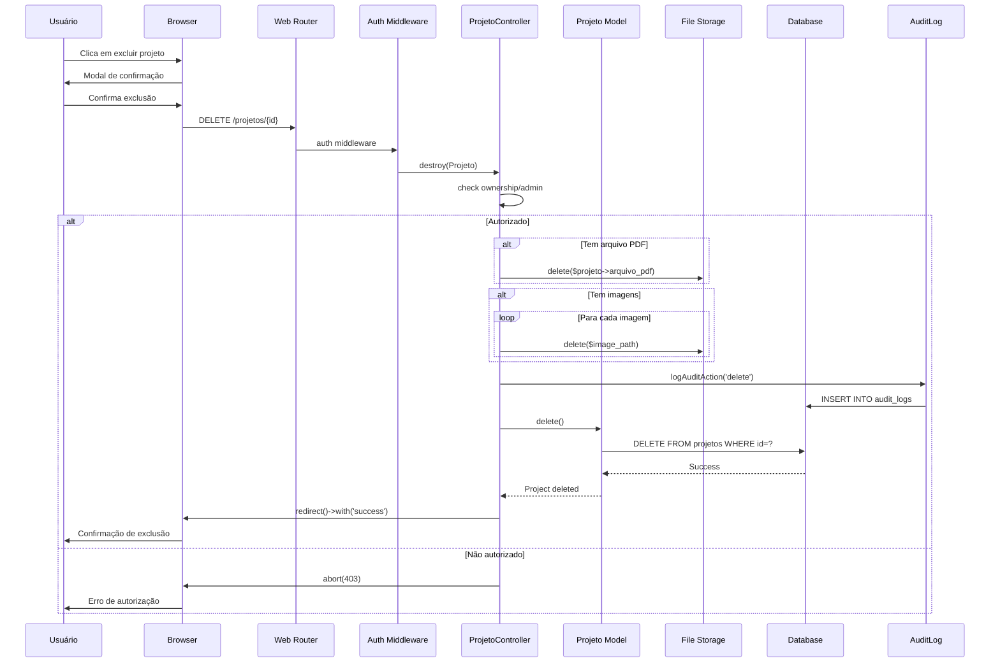

# Diagramas de Sequência - Sistema Tutorando

Este documento apresenta os diagramas de sequência para os principais fluxos do sistema Tutorando, mostrando as interações entre os diferentes atores, controladores e modelos.

## 1. Sequência de Autenticação de Usuário



## 2. Sequência de Registro de Usuário



## 3. Sequência de Criação de Projeto

```mermaid
sequenceDiagram
    participant T as Tutor/Tutorando
    participant B as Browser
    participant WEB as Web Router
    participant AM as Auth Middleware
    participant PC as ProjetoController
    participant V as Validator
    participant PM as Projeto Model
    parameter FS as File Storage
    participant DB as Database
    participant CACHE as Cache
    participant ADMIN as Admin System

    T->>B: Acessa criação de projeto
    B->>WEB: GET /projetos/create
    WEB->>AM: auth middleware
    AM->>PC: create()
    PC->>B: view('projetos.create')
    B->>T: Formulário de criação

    T->>B: Submete dados do projeto
    B->>WEB: POST /projetos
    WEB->>AM: auth middleware
    AM->>PC: store(Request)
    PC->>V: validate($request)
    
    alt Dados válidos
        V-->>PC: Validation passed
        PC->>PM: new Projeto()
        PC->>PM: set project data
        
        alt Usuário é Admin
            PC->>PM: aprovado = true
        else Usuário comum
            PC->>PM: aprovado = false
        end
        
        alt Tem arquivo PDF
            PC->>FS: store('projetos/pdfs')
            FS-->>PC: file path
            PC->>PM: arquivo_pdf = path
        end
        
        alt Tem imagens
            loop Para cada imagem
                PC->>FS: store('projetos/imagens')
                FS-->>PC: image path
            end
            PC->>PM: imagens = paths
        end
        
        PC->>PM: save()
        PM->>DB: INSERT INTO projetos
        DB-->>PM: Project saved
        PM-->>PC: Success
        
        alt Usuário não é Admin
            PC->>ADMIN: Notificar projeto pendente
        end
        
        PC->>B: redirect()->with('success')
        B->>T: Confirmação de criação
    else Dados inválidos
        V-->>PC: Validation failed
        PC->>B: back()->withErrors()
        B->>T: Erros de validação
    end
```

## 4. Sequência de Aprovação de Projeto (Admin)



## 5. Sequência de Busca de Tutores



## 6. Sequência de Publicação de Conteúdo



## 7. Sequência de Aprovação em Massa (Admin)



## 8. Sequência de Edição de Projeto



## 9. Sequência de Dashboard Admin



## 10. Sequência de Exclusão de Conteúdo



## Observações sobre os Diagramas

### Componentes Principais:
- **Controllers**: Gerenciam a lógica de negócio
- **Middleware**: Validam autenticação e autorização
- **Models**: Interagem com o banco de dados
- **Services**: Fornecem funcionalidades específicas (cache, arquivos)
- **Mail System**: Gerencia notificações por email

### Fluxos de Segurança:
- Verificação de autenticação em todas as rotas protegidas
- Verificação de autorização para ações específicas
- Validação de arquivos antes do upload
- Logs de auditoria para ações administrativas

### Otimizações:
- Uso de cache para melhorar performance
- Paginação para listas grandes
- Validação de arquivos para segurança
- Limpeza de cache após alterações

### Estados de Aprovação:
- Conteúdo criado por admins é aprovado automaticamente
- Conteúdo de usuários comuns precisa de aprovação
- Sistema de notificações por email para mudanças de status
